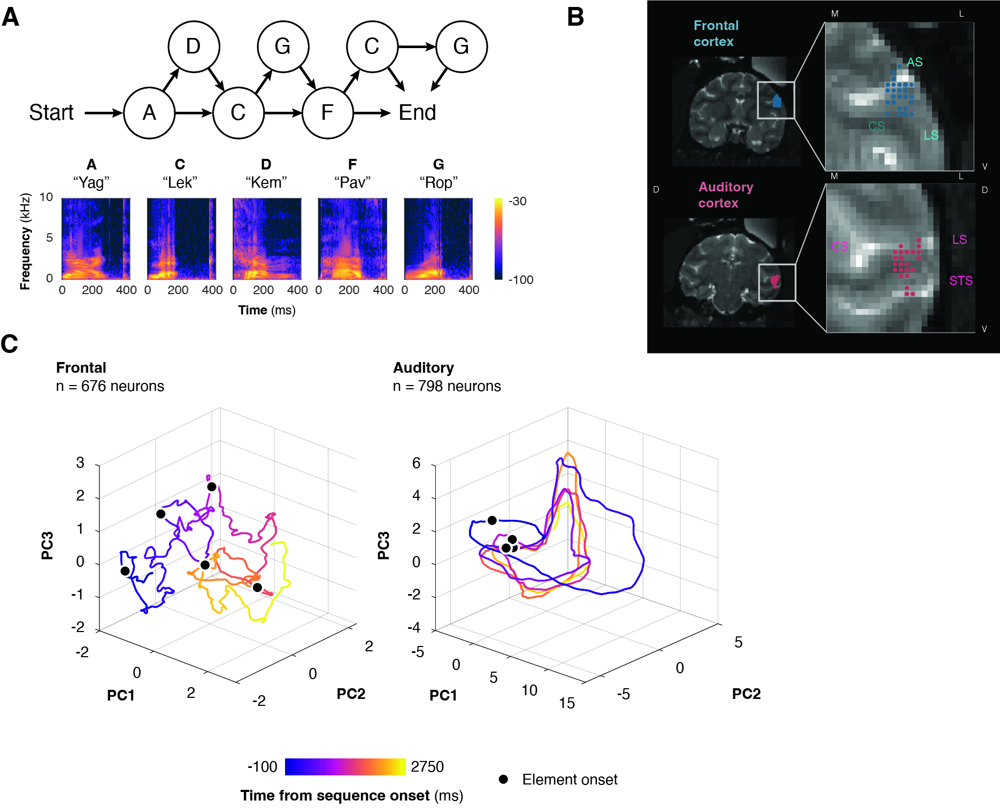

# 🧠 Ordinal Position Encoding in Auditory Sequences

MATLAB analysis code accompanying the manuscript:

> **Ordinal position in auditory sequences is encoded in population dynamics in macaque frontal cortex**


<p align="center">
  
</p>

<p align="center">
  
</p>

<p align="center">
<i><b> Overview of the experimental design and neural population analyses. </b> (A) Top: Transition graph of the artificial grammar used to generate auditory sequences. Sequences begin at node A and proceed through a series of forward-branching transitions to the end node. Bottom: Spectrograms of the five nonsense-word stimuli serving as sequence elements—A ("Yag"), C ("Lek"), D ("Kem"), F ("Pav"), and G ("Rop")—each approximately 413 ms in duration. Colour scale indicates power (dB). (B) Representative coronal section showing recording locations in frontal (left) and auditory cortex (right). Circles indicate electrode tip locations. AS, arcuate sulcus; CS, circular sulcus; LS, lateral sulcus; STS, superior temporal sulcus. (C) Principal component projections of frontal and auditory population activity aligned to sequence onset. Trajectories (5 ms bins) illustrate the evolution of neural state-space dynamics over time, with element onsets denoted by black circles.</i>
</p>

---

## 👋 Welcome!

This repository contains the analysis code used for our investigation into how neural populations in macaque auditory cortex and ventrolateral prefrontal cortex (vlPFC) represent sequential auditory information.

The project explores how the brain keeps track of **where** a sound occurs within a learned sequence—not just **what** sound was heard. The analyses compare neural population dynamics, decoding performance, single-unit activity, temporal response structure, and intrinsic neural timescales across auditory and frontal cortex.

This repository contains the code used throughout the research project, from exploratory analyses through to the final analyses presented in the manuscript.

> **Note:** As this is an active research codebase, you'll find some exploratory and development scripts alongside the final analysis pipeline. The easiest place to begin is the main entry script below.

---

## 🚀 Getting started

The primary entry point is:

```matlab
aglt_analysis_main.m
```

This script walks through the complete analysis pipeline and calls the major analysis modules in order.

The workflow is approximately:

```
Import data
      ↓
Extract spike-density functions
      ↓
Population PCA
      ↓
Identity & position decoding
      ↓
Single-unit GLM analyses
      ↓
Response clustering
      ↓
Sequence autocorrelation
      ↓
Intrinsic timescale estimation
```

If you're trying to understand the codebase, I'd recommend following this script first before exploring the individual functions it calls (as it can be a bit messy in places 😳)

---

## 📂 Repository structure

```
aglt_analysis_main.m      Main analysis pipeline
archive/                  Old scripts that were used through development
analysis/                 Supporting analysis scripts
data/                     Processed data hold (not included)
data-extraction/          Initial scripts to convert raw data into matlab
stimuli/                  Experimental stimuli (& their various checks)
```
The repository also contains a number of exploratory scripts developed during the project. These have been retained for completeness but are not all required to reproduce the manuscript figures.

---

## 🔬 Main analyses

The pipeline includes analyses of:

- 📈 Population PCA and neural trajectories
- 🎯 Linear discriminant decoding (LDA)
- 🔢 Ordinal position representations
- 🔊 Stimulus identity decoding
- 🧩 Single-unit GLM analyses
- 🧮 Functional clustering of neurons
- 🔄 Sequence autocorrelation
- ⏱️ Intrinsic neuronal timescales

---

## 💻 Requirements

The analyses were developed in **MATLAB** and make use of several external toolboxes, including:

- FieldTrip
- gramm

Additional custom helper functions are included throughout the repository, but if missing may also be found in my "toolbox" (also on my GitHub).

---

## 📊 Data availability

The electrophysiological recordings are **not stored in this repository**.

Following acceptance of the manuscript, the processed datasets required to reproduce the analyses will be made publicly available via **OSF (Open Science Framework)**. A link will be added here once the dataset has been released.

---

## 📖 Citation

If you use this repository in your research, please cite:

> Errington SP, Agayby B, Berger JI, Griffiths TD, Kikuchi Y.  
> *Ordinal position in auditory sequences is encoded in population dynamics in macaque frontal cortex.*  
> bioRxiv (2026).

---

## 🤝 Contributing

This repository accompanies an active research project. Feel free to open an issue if you encounter problems or have questions about the analysis pipeline.

---

## 📜 License

See the `LICENSE` file for licensing information.